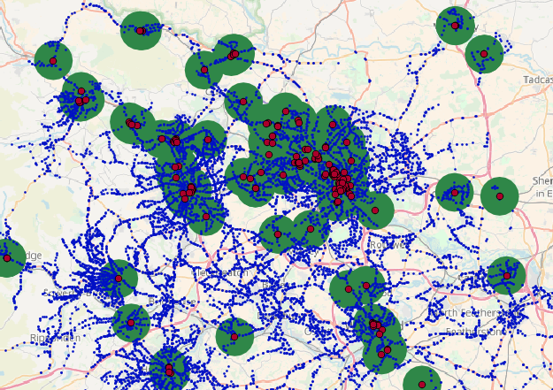
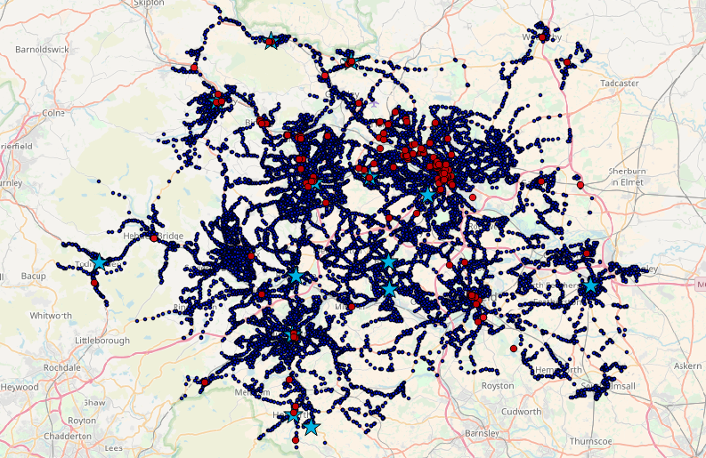
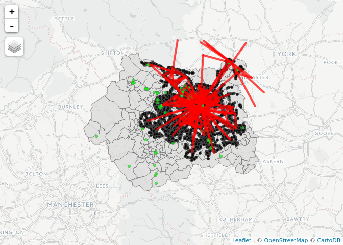

Pedal, Park & Ride
================

We pulled-down data on travel behaviour, public transport routes and cycle parking points.


<p class="caption">
Estimate of 'catchment areas' for cycling to a bus stop with parking
</p>



See [here](http://rpubs.com/RobinLovelace/316902) for an interactive prototype.

``` r
library(tmap)
tmap_mode("view")
```

    ## tmap mode set to interactive viewing

``` r
source("get_zones.R")
```

    ## Linking to GEOS 3.5.1, GDAL 2.2.1, proj.4 4.9.2, lwgeom 2.3.3 r15473

    ## Loading required package: sp

    ## tmap mode set to interactive viewing

``` r
qtm(zones) +
qtm(bus.stops, dots.col = "black") +
qtm(bike.parking, dots.col = "green") +
qtm(lines, lines.lwd = 4)  
```



Next steps
----------

Prioritise the stops which most urgently need cycle parking based on:

-   number of people potentially travelling
-   greatest distance to cycle parking
-   greatest car dependency

Scale-up the interactive map to cover a greater area, and publish the results as an interactive toolkit.

Tech
----

This project uses the development version of the stplanr package:

``` r
devtools::install_github("ropensci/stplanr", ref = "sfr")
```
